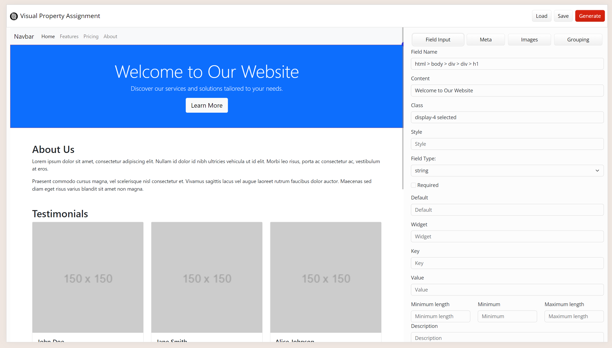
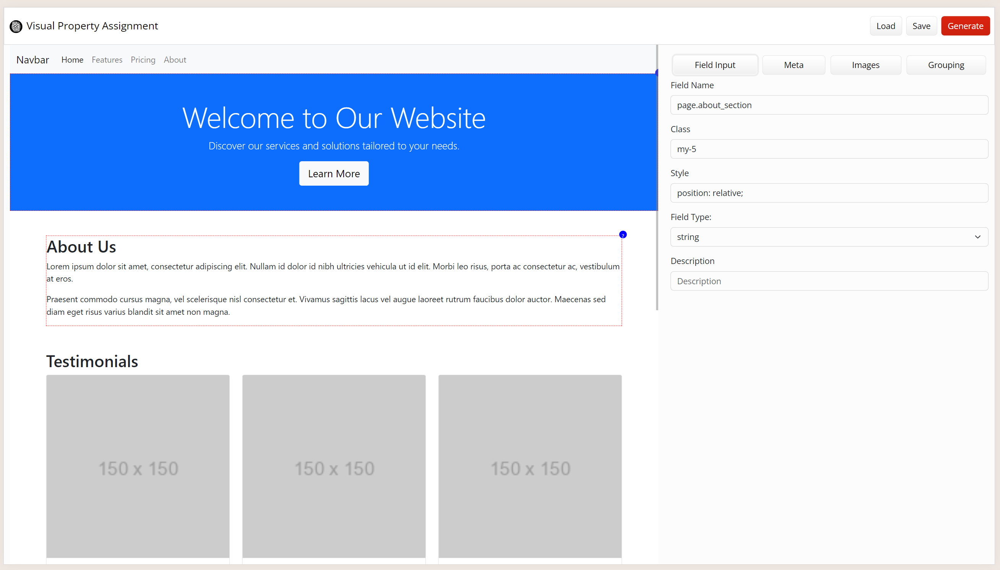
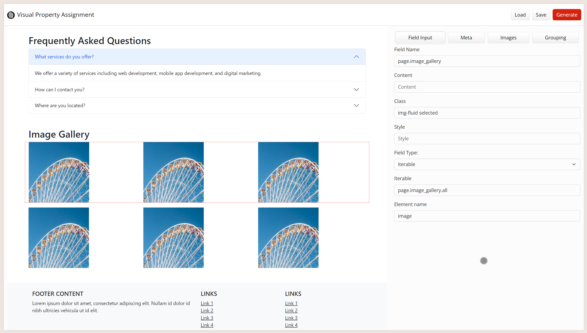

# Visual Property Assignment


## Overview

Visual Property Assignment is a proof-of-concept web-based tool designed to streamline the process of tagging HTML content for automatic generation of backend code. This project aims to enhance the efficiency of web development by providing a visual interface that allows users to assign properties to HTML elements, which can then be used to generate the corresponding backend code. 

A set of defined HTML attributes, called SOML, are used to add intended data types and model information to a HTML document,
without altering the visual appearance. SOML is then translated to JSON Schema, which is used to generate backend code, 
mainly Django model, views, templates, api's etc. 

## Features

- **Visual Interface:** An intuitive interface to select and assign properties to HTML elements.
- **Dynamic Form Generation:** Automatically generates forms based on selected HTML elements for property assignment.
- **Grouping and Visualization:** Allows grouping of elements and visualizes parent-child relationships.
- **Meta Tag Handling:** Supports the parsing and editing of meta tags.
- **Image Handling:** Identifies and processes image elements, including background images.
- **HTML Parsing:** Loads and parses HTML content from a URL or file.
- **Code Generation:** Generates backend code based on assigned properties and copies the generated code to the clipboard or saves it to a file.

## Screenshots



The basic interface after loading a page, show to the left. Property panel shown to the right. Clicking in the page selected the underlying HTML element and display available properties. Images and meta data can be assigned on separate tabs, including background images (TODO: images from stylesheets.)



A container object, like a div, can be selected even if it isn't visible, but going to the "Grouping" tab, clicking on an element, and selecting the direct parent from a dropdown. The current selection will be visualized as a red box.



Iterables, like django orm queries, can be specified, and the following process, going thru the SOML steps, will translate the code and add django template tags for handling of iterable data, like a image gallery in this example.

## Usage

### Loading HTML Content

TODO : You can load HTML content from a URL or a file. Use the "Load" button to open a file-selector dialog and load the HTML content.

### Assigning Properties

1. **Select Elements:** Click on an HTML element in the iframe to select it. Use Ctrl or Cmd key for multi-selection.
2. **Assign Properties:** Use the dynamically generated form to assign properties to the selected elements.
3. **Field Types:** Choose from a variety of field types (e.g., string, number, boolean) and assign relevant properties.

### Grouping Elements

Group selected elements using the "Group Selected" button. This feature helps in managing and organizing related HTML elements together.

### Visualizing Parent Elements

Visualize the parent elements using the "Visualize Parent" dropdown. This feature highlights the parent elements, helping you understand the hierarchy and relationships between elements.

### Generating Code

Use the "Generate" button to generate the backend code based on the assigned properties. The generated code can be copied to the clipboard or saved to a file for further use.

## Development

### Project Structure

- **index.html:** The main HTML file containing the structure of the application.
- **styles.css:** Contains custom CSS styles for the application.
- **scripts.js:** Main JavaScript file containing the logic for the application.
- **utilities.js:** Contains utility functions used across the application.

### Installation

1. Clone the repository:

```bash
git clone https://github.com/weholt/visual-property-assignment.git
```

2. Navigate to the project directory:

```bash
cd visual-property-assignment
```

3. Start the custom CORS-enabled server to serve the test template, base.html

``` bash
python cors_server.py
```

4. Open `index.html` in your web browser to start using the application.

### Dependencies

The project uses Bootstrap 5.3.3 for styling and layout. Ensure you have an internet connection to load the Bootstrap CSS and JS from the CDN.

### License

This project is licensed under the AGPL License. See the [LICENSE](LICENSE) file for details.

## Contact

For any questions or feedback, feel free to contact me at [thomas@weholt.org](mailto:thomas@weholt.org).


---

**Author:** Thomas Weholt  
**Homepage:** [weholt.org](https://weholt.org)  
**GitHub:** [weholt](https://github.com/weholt)  
**Email:** [thomas@weholt.org](mailto:thomas@weholt.org)
**License:** AGPL

---
